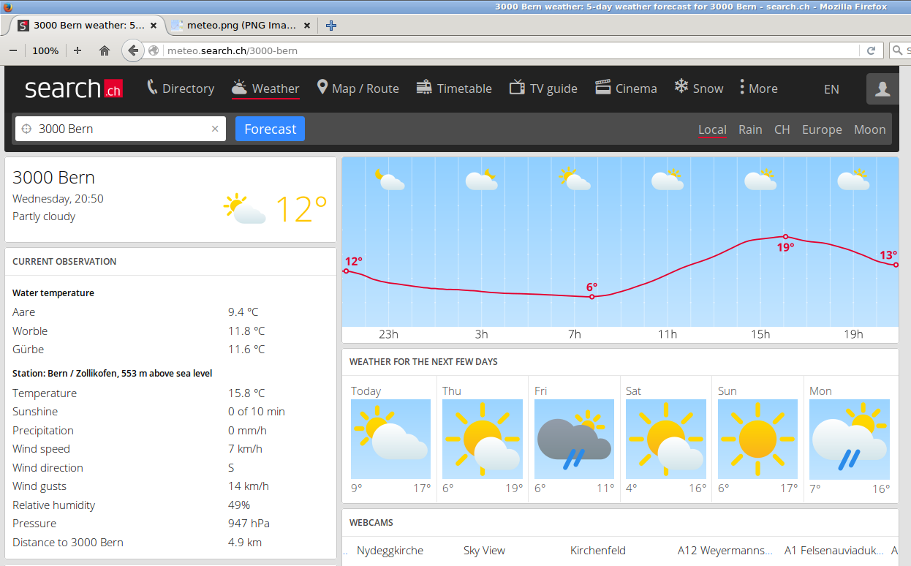
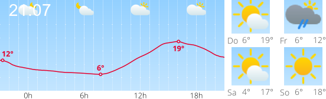

meteo
=====

A meteo mashup tailored to my personal needs. Uses [CutyCapt](http://cutycapt.sourceforge.net/) 
to capture [http://meteo.search.ch/3000](http://meteo.search.ch/3000):

and [ImageMagick](http://www.imagemagick.org/) to transform it into a compact version:

The [URL Image Widget](https://play.google.com/store/apps/details?id=com.weite_welt.urlimagewidget) app
can be used to display the personalized weather forecast on the home screen of your Android device.

